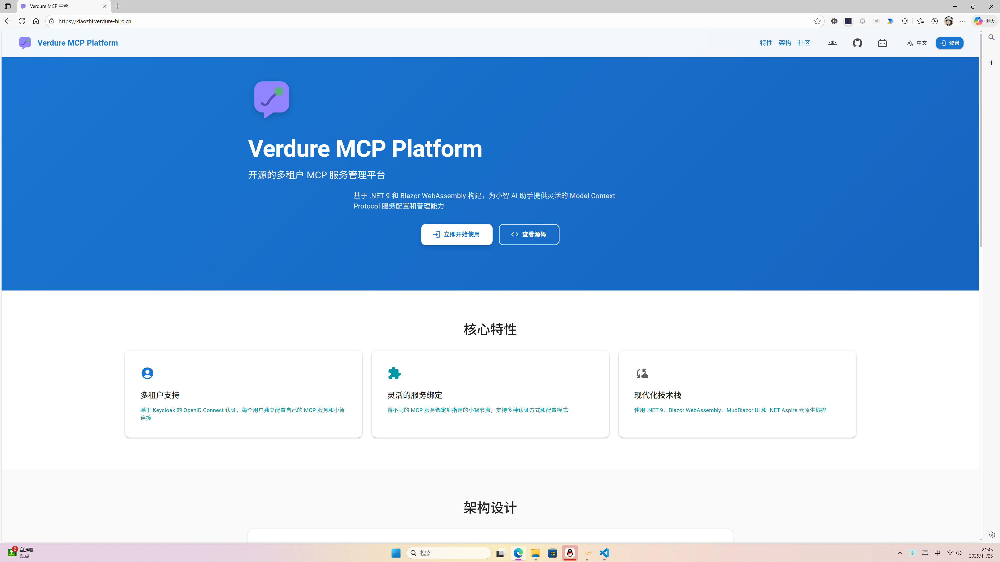
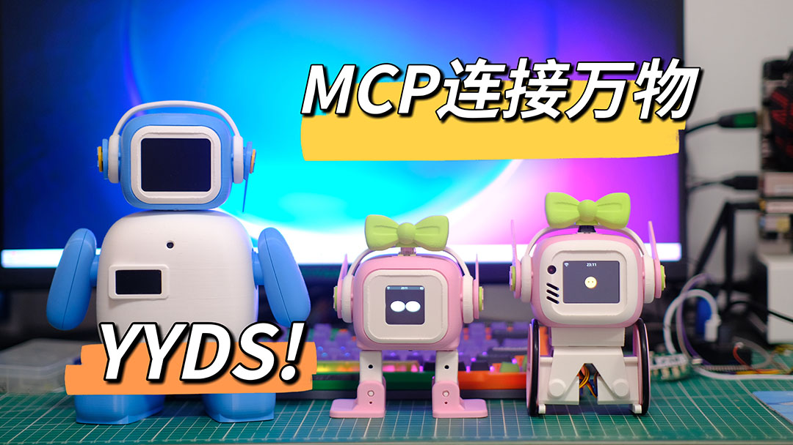
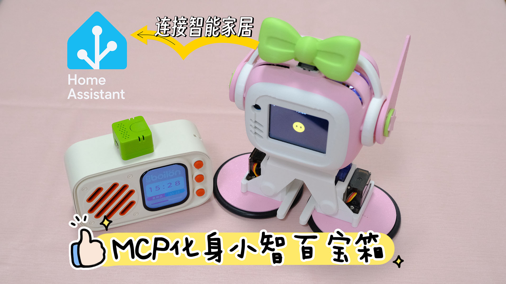

<div align="center">
  
  
  # Verdure MCP Platform
  
  > 开源的多租户 MCP 服务管理平台，为小智 AI 助手提供灵活的 Model Context Protocol 服务配置和管理能力
  
  [](https://dotnet.microsoft.com/)
  [](https://dotnet.microsoft.com/apps/aspnet/web-apps/blazor)
  [](https://mudblazor.com/)
  [](./LICENSE)
  
  [在线体验](#-在线服务) · [快速开始](#-快速开始) · [视频教程](#-视频教程) · [社区交流](#-社区与支持)
</div>

---

---

## 🌟 在线服务

**立即体验，无需安装！**

🔗 **在线平台**: [https://xiaozhi.verdure-hiro.cn/](https://xiaozhi.verdure-hiro.cn/)

- ✅ 免费注册，即刻使用
- ✅ 无需部署，云端托管
- ✅ 稳定可靠，持续更新

<div align="center">
  
  <p><i>平台运行截图</i></p>
</div>

---

## 🎬 视频教程

### 📺 B站视频演示

<table>
<tr>
<td width="50%" align="center">

**小智 MCP 转接服务上线与开源**

[](https://www.bilibili.com/video/BV1LYkyBoEh1/)

[🎬 点击观看](https://www.bilibili.com/video/BV1LYkyBoEh1/)

适合小智商家和小智爱好者

</td>
<td width="50%" align="center">

**私有化部署与米家智能家居控制**

[](https://www.bilibili.com/video/BV1eJUTBYEsi/)

[🎬 点击观看](https://www.bilibili.com/video/BV1eJUTBYEsi/)

手把手教你部署和玩转米家

</td>
</tr>
</table>

---

## 📖 项目介绍

Verdure MCP Platform 是一个基于 .NET 10 和 Blazor WebAssembly 构建的企业级多租户 SaaS 平台，专为小智 AI 助手设计，提供完整的 Model Context Protocol (MCP) 服务管理解决方案。

**核心功能**：
- 🔐 多租户身份认证系统（基于 Keycloak OpenID Connect）
- 🌐 每个用户可配置自己的小智 AI 服务器地址
- 🔗 将不同的 MCP 服务绑定到指定节点
- 🚀 通过 WebSocket 连接提供对应的 MCP 服务
- 💾 仓储模式 (Repository Pattern) 实现数据访问层
- 🗄️ 支持 PostgreSQL 和 SQLite 多数据库

## ✨ 核心特性

<table>
<tr>
<td width="50%">

### 🔐 多租户支持
- 基于 Keycloak 的 OpenID Connect 认证
- 每个用户独立配置 MCP 服务和小智连接
- 完整的权限管理和数据隔离
- 支持多种认证方式（Bearer、Basic、OAuth2、API Key）

### 🌐 灵活的服务绑定
- 支持多种 MCP 服务配置
- 动态绑定服务到小智节点
- 实时 WebSocket 连接管理
- 自动故障恢复和重连机制

</td>
<td width="50%">

### 🚀 现代化技术栈
- .NET 10 后端 API + Blazor WebAssembly 前端
- MudBlazor UI 组件库（Material Design 3）
- .NET Aspire 云原生应用编排
- Entity Framework Core 9.0 数据访问

### 🏛️ 优秀的架构设计
- 领域驱动设计 (DDD)
- 仓储模式 (Repository Pattern)
- 前后端分离架构
- 完整的国际化 (i18n) 支持（中文/英文）

</td>
</tr>
</table>

## 🏗️ 项目架构

```
verdure-mcp-for-xiaozhi/
├── src/
│   ├── Verdure.McpPlatform.AppHost/           # Aspire 应用宿主
│   ├── Verdure.McpPlatform.ServiceDefaults/   # 共享服务配置
│   ├── Verdure.McpPlatform.Api/               # Web API 项目
│   ├── Verdure.McpPlatform.Web/               # Blazor WebAssembly 前端
│   ├── Verdure.McpPlatform.Domain/            # 领域层
│   ├── Verdure.McpPlatform.Infrastructure/    # 基础设施层
│   ├── Verdure.McpPlatform.Application/       # 应用服务层
│   └── Verdure.McpPlatform.Contracts/         # 共享契约
└── tests/                                      # 测试项目
```

详细架构说明请参考 [AGENTS.md](./AGENTS.md)

## 🚀 快速开始

### 🎯 三种使用方式，任你选择

<table>
<tr>
<td align="center" width="33%">

### 🌐 在线使用

**最快捷的方式**

访问 [在线平台](https://xiaozhi.verdure-hiro.cn/)

✅ 无需安装<br>
✅ 即开即用<br>
✅ 云端托管

[立即体验 →](https://xiaozhi.verdure-hiro.cn/)

</td>
<td align="center" width="33%">

### 🐳 Docker 部署

**最简单的本地部署**

一键启动完整环境

✅ 包含所有依赖<br>
✅ 3-5分钟启动<br>
✅ 适合私有部署

[查看教程 ↓](#方式一本地-docker-一键启动-推荐)

</td>
<td align="center" width="33%">

### 💻 开发环境

**适合二次开发**

.NET 10 开发环境

✅ 完整源码<br>
✅ 灵活定制<br>
✅ 适合开发者

[查看教程 ↓](#方式二net-开发环境)

</td>
</tr>
</table>

---

### 方式一：本地 Docker 一键启动 (推荐⭐)

**最简单的方式，包含完整环境：PostgreSQL + Redis + Keycloak + 应用**

#### 前置要求
- [Docker Desktop](https://www.docker.com/products/docker-desktop/) (Windows/Mac) 或 Docker + Docker Compose (Linux)
- PowerShell 5.1+ 或 PowerShell Core 7+

#### 一键启动
```powershell
# 克隆仓库
git clone https://github.com/maker-community/verdure-mcp-for-xiaozhi.git
cd verdure-mcp-for-xiaozhi

# 启动所有服务（首次启动约需 3-5 分钟）
.\scripts\start-local.ps1
```

#### 访问应用
- **应用**: http://localhost:8080
- **Keycloak 管理**: http://localhost:8180 (admin / admin)

#### 演示账号
- **管理员**: admin / admin123
- **普通用户**: demo / demo123

#### 其他命令
```powershell
# 查看服务状态
.\scripts\health-check.ps1

# 查看日志
.\scripts\view-logs.ps1

# 停止服务
.\scripts\stop-local.ps1
```

📖 **详细文档**: [Docker 本地部署指南](./docker/README.md)

---

### 方式二：.NET 开发环境

**适合需要修改代码的开发者**

#### 前置要求
- [.NET 10 SDK](https://dotnet.microsoft.com/download/dotnet/10.0)
- [PostgreSQL](https://www.postgresql.org/download/) 或 SQLite
- [Redis](https://redis.io/download) (可选，用于分布式功能)
- [Keycloak](https://www.keycloak.org/) (可选，用于认证)

#### 安装步骤

1. **克隆仓库**
```bash
git clone https://github.com/maker-community/verdure-mcp-for-xiaozhi.git
cd verdure-mcp-for-xiaozhi
```

2. **恢复依赖**
```bash
dotnet restore
```

3. **配置数据库**

编辑 `src/Verdure.McpPlatform.Api/appsettings.json`:
```json
{
  "ConnectionStrings": {
    "Redis": "localhost:6379",
    "mcpdb": "",
    "identitydb": ""
  },
}
```

4. **运行应用（通过 Aspire）**
```bash
dotnet run --project src/Verdure.McpPlatform.AppHost
```

或单独运行各服务：
```bash
# 运行 API
dotnet run --project src/Verdure.McpPlatform.Api

# 运行 Web 前端
dotnet run --project src/Verdure.McpPlatform.Web
```

5. **访问应用**
- Web UI: https://localhost:5001
- API: https://localhost:5000
- Aspire Dashboard: https://localhost:17181

---

## 🎯 使用流程

### 快速上手指南

<div align="center">
  <table>
    <tr>
      <td align="center" width="25%">
        <br>
        <b>1️⃣ 注册登录</b>
        <br><br>
        访问平台注册账号<br>
        或使用演示账号
        <br><br>
      </td>
      <td align="center" width="25%">
        <br>
        <b>2️⃣ 配置小智连接</b>
        <br><br>
        添加你的小智 AI<br>
        服务器 WebSocket 地址
        <br><br>
      </td>
      <td align="center" width="25%">
        <br>
        <b>3️⃣ 创建 MCP 服务</b>
        <br><br>
        配置 MCP 服务<br>
        支持多种认证方式
        <br><br>
      </td>
      <td align="center" width="25%">
        <br>
        <b>4️⃣ 绑定并使用</b>
        <br><br>
        将服务绑定到节点<br>
        开始享受 MCP 能力
        <br><br>
      </td>
    </tr>
  </table>
</div>

### 详细步骤

1. **登录系统** - 使用 Keycloak 账号登录平台，或访问[在线服务](https://xiaozhi.verdure-hiro.cn/)直接注册
2. **配置小智连接** - 在"小智连接"页面添加你的小智 AI 服务器 WebSocket 地址
3. **创建 MCP 服务** - 在"MCP 服务"页面配置服务，支持 Bearer Token、Basic Auth、OAuth2、API Key 等多种认证
4. **绑定服务到节点** - 在"服务绑定"页面将 MCP 服务绑定到小智节点，选择需要的工具
5. **开始使用** - 在小智中就可以使用绑定的 MCP 服务提供的各种能力了！

💡 **提示**: 观看我们的 [B站视频教程](#-视频教程) 获取更详细的操作演示

---

## ❓ 常见问题

<details>
<summary><b>什么是 MCP (Model Context Protocol)？</b></summary>
<br>
MCP 是一个开放的 AI 上下文协议标准，它允许 AI 助手通过标准化的接口访问各种外部工具和数据源。通过 MCP，小智可以连接到文件系统、数据库、API 服务等，大大扩展其能力边界。
</details>

<details>
<summary><b>在线服务是免费的吗？</b></summary>
<br>
是的，目前在线服务完全免费提供给所有用户使用。我们也提供开源代码支持私有部署。
</details>

<details>
<summary><b>支持哪些 MCP 服务？</b></summary>
<br>
平台支持所有符合 MCP 标准的服务，包括但不限于：
<ul>
  <li>🏠 米家智能家居控制</li>
  <li>📁 文件系统访问</li>
  <li>🗄️ 数据库查询</li>
  <li>🌐 HTTP API 调用</li>
  <li>🔧 自定义工具集成</li>
</ul>
查看 <a href="https://www.bilibili.com/video/BV1eJUTBYEsi/">米家控制视频教程</a> 了解实际应用案例。
</details>

<details>
<summary><b>如何获取技术支持？</b></summary>
<br>
<ul>
  <li>📺 观看 <a href="#-视频教程">B站视频教程</a></li>
  <li>💬 加入 QQ 交流群：<b>1023487000</b></li>
  <li>🐛 提交 <a href="https://github.com/maker-community/verdure-mcp-for-xiaozhi/issues">GitHub Issues</a></li>
</ul>
</details>

<details>
<summary><b>可以商业使用吗？</b></summary>
<br>
可以！本项目采用 MIT 开源协议，允许商业使用。你可以：
<ul>
  <li>✅ 免费使用在线服务</li>
  <li>✅ 私有部署用于商业项目</li>
  <li>✅ 基于源码进行二次开发</li>
  <li>✅ 集成到你的产品中</li>
</ul>
唯一要求是保留原始的版权声明。
</details>

---

## 📚 文档

- [架构指南](./AGENTS.md) - 详细的架构设计和开发指南
- [部署指南](./DEPLOYMENT.md) - 生产环境部署说明
- [API 文档](./API_EXAMPLES.md) - API 使用示例
- [前端改进](./FRONTEND_IMPROVEMENTS.md) - 最新的前端更新说明
- [本地 NuGet 包使用](./local-packages/README.md) - 使用本地编译的 NuGet 包

---

## 🌐 社区与支持

<div align="center">

### 加入我们的社区，获取帮助和分享经验！

<table>
<tr>
<td align="center" width="33%">

### 💬 QQ 交流群

**绿荫DIY硬件交流群**

群号：**1023487000**

讨论 AI、MCP 和硬件 DIY

</td>
<td align="center" width="33%">

### 📺 B站 UP主

**绿荫阿广**

[访问主页](https://space.bilibili.com/25228512)

获取更多 AI 和创客教程

</td>
<td align="center" width="33%">

### 🐙 GitHub 社区

**Maker Community**

[访问组织](https://github.com/maker-community)

贡献代码，参与开发

</td>
</tr>
</table>

</div>

### 📮 联系方式

- 📧 问题反馈: [GitHub Issues](https://github.com/maker-community/verdure-mcp-for-xiaozhi/issues)
- 💡 功能建议: [GitHub Discussions](https://github.com/maker-community/verdure-mcp-for-xiaozhi/discussions)
- 🎥 视频教程: [B站 @绿荫阿广](https://space.bilibili.com/25228512)

## 🤝 贡献

我们欢迎所有形式的贡献！无论是代码、文档、问题反馈还是建议。

### 如何贡献

1. 🍴 Fork 本仓库
2. 🌿 创建特性分支 (`git checkout -b feature/AmazingFeature`)
3. 💾 提交更改 (`git commit -m 'Add some AmazingFeature'`)
4. 📤 推送到分支 (`git push origin feature/AmazingFeature`)
5. 🔀 创建 Pull Request

### 贡献指南

- 查看 [AGENTS.md](./AGENTS.md) 了解项目架构和开发规范
- 遵循现有的代码风格和提交规范
- 为新功能添加相应的测试和文档
- 确保所有测试通过后再提交 PR

### 贡献者

感谢所有为这个项目做出贡献的开发者！

<a href="https://github.com/maker-community/verdure-mcp-for-xiaozhi/graphs/contributors">
  
</a>

## 📄 开源协议

本项目采用 [MIT License](./LICENSE) 开源协议。

## 🙏 致谢

感谢以下开源项目和技术：

- [Microsoft .NET](https://dotnet.microsoft.com/) - 强大的跨平台开发框架
- [MudBlazor](https://mudblazor.com/) - 优秀的 Blazor UI 组件库
- [Keycloak](https://www.keycloak.org/) - 开源的身份认证和访问管理解决方案
- [Model Context Protocol](https://modelcontextprotocol.io/) - AI 上下文协议标准
- [Entity Framework Core](https://docs.microsoft.com/ef/core/) - 现代化的 ORM 框架
- [.NET Aspire](https://learn.microsoft.com/dotnet/aspire/) - 云原生应用编排框架

特别感谢所有支持和使用本项目的小智用户和开发者！

---

<div align="center">
  
  **⭐ 如果这个项目对你有帮助，请给我们一个 Star！⭐**
  
  Made with ❤️ by [绿荫阿广](https://space.bilibili.com/25228512) and the [Maker Community](https://github.com/maker-community)
  
  [🏠 返回顶部](#verdure-mcp-platform)
  
</div>
