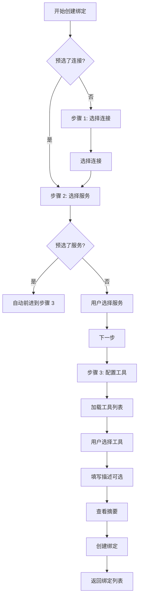

# MCP 服务绑定创建向导改进

## 📋 概述

重新设计了 MCP 服务绑定创建页面，使用优雅的三步向导流程，解决了分页数量过多和数据安全性问题。

## 🎯 设计目标

### 1. **统一私有和公开服务选择**
- 用户可以在同一个界面选择私有服务和公开服务
- 通过标签页（Tabs）区分 "我的服务" 和 "公开服务"

### 2. **支持大量数据的分页选择**
- 使用 `MudVirtualize` 组件实现虚拟化滚动
- 小智连接和 MCP 服务都支持搜索、排序和分页加载
- 每页加载 12 项，性能优异

### 3. **数据安全性**
- MCP 服务卡片只显示：ID、名称、描述、工具列表
- **不暴露**：连接地址 (Endpoint)、认证配置、密钥等敏感信息
- 即使是私有服务，在绑定页面也不显示敏感数据

### 4. **优雅的用户体验**
- 三步向导清晰引导用户完成绑定
- 自定义步骤进度指示器，显示当前步骤和完成状态
- 卡片式选择界面，视觉效果优雅
- 统一的蓝色配色方案（`#1976D2` - `#1565C0`）

## 🛠️ 实现细节

### 三步向导流程

#### 步骤 1: 选择小智连接 (Xiaozhi Connection)
```
- 虚拟化卡片列表（ConnectionSelectorCard）
- 搜索功能（按名称/描述）
- 排序选项（名称、创建时间、状态）
- 分页加载（12项/页）
- 显示连接状态（已连接/未连接/未启动）
- 显示绑定数量
```

#### 步骤 2: 选择 MCP 服务
```
- 标签页区分 "我的服务" / "公开服务"
- 虚拟化卡片列表（McpServiceSelectorCard）
- 搜索功能（按名称/描述）
- 排序选项（名称、创建时间）
- 分页加载（12项/页）
- 显示协议类型和工具数量
- 只显示安全信息，不暴露端点和密钥
```

#### 步骤 3: 配置工具和确认
```
- 异步加载选中服务的工具列表
- 工具搜索和筛选功能
- 多选复选框选择工具
- 可选描述字段
- 绑定摘要卡片（显示已选连接、服务和工具数量）
```

### 关键组件使用

#### 1. **ConnectionSelectorCard**
```razor
- 自定义选择卡片
- 显示连接名称、状态、描述
- 连接状态指示器（彩色小圆点）
- 绑定数量显示
- 选中状态视觉反馈（蓝色边框和阴影）
```

#### 2. **McpServiceSelectorCard**
```razor
- 自定义服务选择卡片
- 显示服务名称、Logo、描述
- 协议类型和工具数量 badges
- 公开/私有服务标识
- 选中状态视觉反馈
```

#### 3. **自定义步骤进度条**
```razor
- 三个步骤圆形图标
- 当前步骤高亮显示
- 已完成步骤显示对勾图标
- 箭头连接各步骤
- 响应式布局
```

### 数据流程



### 虚拟化实现

```csharp
// 每个步骤都使用 MudVirtualize 组件
// 支持高效的分页加载和滚动
private async ValueTask<ItemsProviderResult<T>> LoadItemsVirtualized(
    ItemsProviderRequest request)
{
    // 计算需要加载的页范围
    var startPage = (request.StartIndex / PageSize) + 1;
    var endPage = ((request.StartIndex + request.Count - 1) / PageSize) + 1;
    
    // 批量加载多页数据
    for (var page = startPage; page <= endPage; page++)
    {
        var result = await Service.GetPagedAsync(...);
        allItems.AddRange(result.Items);
    }
    
    // 返回请求的子集
    return new ItemsProviderResult<T>(items, totalCount);
}
```

## 🎨 UI/UX 改进

### 1. **统一的设计语言**
- M3 Material Design 风格
- 蓝色渐变主题（`#1976D2` → `#1565C0`）
- 卡片圆角 12px
- 柔和的阴影效果

### 2. **视觉层次**
- Hero Banner: 深蓝渐变背景，白色文字
- 步骤指示器: 浅蓝渐变背景
- 内容区域: 白色背景，清晰的边框
- 操作按钮: 主按钮填充蓝色，次要按钮文本样式

### 3. **交互反馈**
- 选中卡片: 蓝色边框 + 蓝色阴影
- 悬停效果: 向上移动 2px + 阴影加深
- 加载状态: 骨架屏占位符
- 按钮禁用: 清晰的视觉提示

### 4. **响应式设计**
- 桌面: 4 列卡片 (lg)
- 平板: 3 列卡片 (md)
- 小平板: 2 列卡片 (sm)
- 手机: 1 列卡片 (xs)

## 📱 多语言支持

已添加的本地化键：

### 中文 (zh-CN)
```xml
ChooseXiaozhiConnection: "选择小智连接"
SelectConnectionHelp: "选择要绑定 MCP 服务的小智连接端点"
ChooseMcpService: "选择 MCP 服务"
SelectMcpServiceHelp: "选择要绑定到连接的 MCP 服务（可以是私有服务或公开服务）"
BindingSummary: "绑定摘要"
SelectedToolsCount: "已选工具数量"
SearchTools: "搜索工具"
FilterToolsByName: "按名称或描述筛选工具"
ServiceBindingCreatedSuccess: "服务绑定创建成功"
ErrorLoadingTools: "加载工具时出错"
Active: "当前"
ToolsCount: "{0} 个工具"
BindingsCount: "{0} 个绑定"
```

### 英文 (en)
```xml
ChooseXiaozhiConnection: "Choose Xiaozhi Connection"
SelectConnectionHelp: "Select the Xiaozhi connection endpoint to bind the MCP service to"
ChooseMcpService: "Choose MCP Service"
SelectMcpServiceHelp: "Select the MCP service to bind to the connection (can be a private or public service)"
BindingSummary: "Binding Summary"
SelectedToolsCount: "Selected Tools"
SearchTools: "Search Tools"
FilterToolsByName: "Filter tools by name or description"
ServiceBindingCreatedSuccess: "Service binding created successfully"
ErrorLoadingTools: "Error loading tools"
Active: "Active"
ToolsCount: "{0} tools"
BindingsCount: "{0} bindings"
```

## 🔐 数据安全性

### 服务卡片显示的信息
**✅ 安全显示**:
- 服务 ID
- 服务名称
- 服务描述
- 工具列表（名称和描述）
- 协议类型 (stdio/http/sse)
- 公开/私有标识

**❌ 不显示**:
- 服务端点地址 (Endpoint)
- 认证类型 (AuthenticationType)
- 认证配置 (AuthenticationConfig)
- API 密钥、Token、密码等敏感信息

### 实现方式
```csharp
// 现有的 McpServiceConfigDto 已经包含所有字段
// 但在 McpServiceSelectorCard 组件中，
// 我们只绑定和显示非敏感字段
<McpServiceSelectorCard Service="@service"
                       IsSelected="..."
                       OnSelect="..." />

// 组件内部只访问:
// service.Id, service.Name, service.Description
// service.Tools, service.Protocol, service.IsPublic
```

## 🚀 性能优化

### 1. **虚拟化滚动**
- 只渲染可见区域的卡片
- `OverscanCount="4"` 预渲染上下各 4 项
- 支持平滑滚动，无卡顿

### 2. **分页加载**
- 按需加载数据，每页 12 项
- 智能计算需要加载的页范围
- 避免一次性加载所有数据

### 3. **防抖搜索**
- 搜索输入防抖 500ms
- 减少不必要的 API 调用

### 4. **状态管理**
- 记忆用户的选择状态
- 避免重复加载已选项的详情

## 📊 用户流程示例

### 场景 1: 从零创建绑定
```
1. 点击 "添加服务绑定"
2. [步骤 1] 浏览小智连接列表 → 搜索 "生产环境" → 选择 "Production Xiaozhi"
3. 点击 "下一步"
4. [步骤 2] 切换到 "公开服务" 标签 → 搜索 "天气" → 选择 "OpenWeather API"
5. 点击 "下一步"
6. [步骤 3] 查看 5 个可用工具 → 选择 "getCurrentWeather" 和 "getForecast"
7. 填写描述: "生产环境天气查询服务"
8. 查看摘要 → 点击 "创建"
9. 成功提示 → 返回绑定列表
```

### 场景 2: 从公开服务页面快速绑定
```
1. 在 "公开服务" 页面浏览
2. 点击某服务的 "使用此服务" 按钮
3. 跳转到绑定创建页面，服务已预选
4. [步骤 1] 选择小智连接
5. 自动跳到 [步骤 3]
6. 配置工具 → 创建
```

### 场景 3: 从小智连接页面添加绑定
```
1. 在 "小智连接" 页面点击某连接的 "查看绑定"
2. 在绑定列表点击 "添加服务"
3. 连接已预选，直接进入 [步骤 2]
4. 选择服务 → 配置工具 → 创建
```

## 🔄 后续优化建议

### 1. **轻量级 DTO (可选)**
虽然当前实现已经在 UI 层面隐藏了敏感数据，但可以考虑创建专门的轻量级 DTO：

```csharp
public record McpServiceConfigLightDto
{
    public string Id { get; init; }
    public string Name { get; init; }
    public string? Description { get; init; }
    public string? Protocol { get; init; }
    public bool IsPublic { get; init; }
    public List<McpToolDto> Tools { get; init; } = new();
    public string? LogoUrl { get; init; }
}
```

**优点**:
- 减少数据传输量
- 明确的安全边界
- 更好的 API 文档
- 防止前端意外访问敏感数据

**当前方案**:
- 使用完整的 `McpServiceConfigDto`
- UI 组件只显示非敏感字段
- 实现简单，无需修改后端

### 2. **API 端点优化 (可选)**
添加专门的 "绑定选择" API：

```csharp
// GET /api/mcp-services/for-binding?page=1&pageSize=12&type=my|public
// 返回轻量级 DTO，包含工具但不包含敏感配置
```

### 3. **缓存优化**
- 前端缓存已加载的工具列表
- 避免用户来回切换步骤时重复加载

### 4. **工具预览**
- 在步骤 2 中显示服务的工具数量
- 悬停卡片时预览工具列表（Tooltip）

## ✅ 完成状态

- [x] 创建三步骤向导页面
- [x] 实现虚拟化分页选择
- [x] 添加多语言支持
- [x] 确保数据安全性
- [x] 统一 UI 设计风格
- [ ] 后端 API 优化（可选）
- [ ] 创建轻量级 DTO（可选）
- [ ] 完整测试流程

## 📝 技术栈

- **UI 框架**: MudBlazor 8.x
- **虚拟化**: MudVirtualize (Blazor Component)
- **状态管理**: Blazor Component State
- **本地化**: .NET Resource Files (.resx)
- **路由**: Blazor Routing
- **HTTP 客户端**: HttpClient + System.Net.Http.Json

## 🎯 设计原则遵循

1. ✅ **一致性**: 与小智连接和 MCP 服务页面保持统一的卡片设计
2. ✅ **安全性**: 不暴露敏感数据（端点、密钥）
3. ✅ **可扩展性**: 支持大量数据的分页加载
4. ✅ **可用性**: 清晰的步骤引导和视觉反馈
5. ✅ **响应式**: 适配各种屏幕尺寸
6. ✅ **国际化**: 完整的多语言支持
7. ✅ **性能**: 虚拟化滚动，高效渲染

---

**创建时间**: 2025-11-06
**版本**: 1.0
**状态**: 已完成前端实现，待测试
